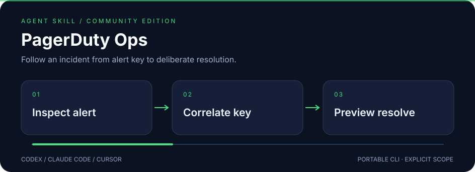

# PagerDuty Incidents

<p></p>

**Follow an incident from alert key to deliberate resolution.**



A standalone skill for **Codex · Claude Code · Cursor**, backed by a portable Python CLI.
Independent community project; not affiliated with or endorsed by the provider.

## ✨ What it does

- Connect an incident's alert_key to the Events API dedup_key used for acknowledgement or resolution.
- Keep REST API credentials separate from Events integration routing keys, supplied by environment or private files.
- Preview all writes; batch resolution deduplicates 1–100 keys and requires both execution and confirmation flags.

## 🚀 Install

Requires Node.js **22.20+** for the tested skills installer.

```sh
npx skills@1.7.1 add joeeeeey/pagerduty-incidents --agent codex claude-code cursor --yes
```

[View on skills.sh](https://skills.sh/joeeeeey/pagerduty-incidents/pagerduty-incidents)

Then ask your agent to use **pagerduty-incidents**. The standard SKILL.md and bundled CLI are the
portable interface; no dependency on another personal skill is needed.

## 🔎 Try it

From the installed skill directory, or a repository checkout:

```sh
python3 scripts/pd_api.py incidents list --statuses triggered,acknowledged --summary
python3 scripts/pd_api.py events resolve --dedup-key synthetic-demo
```

Python 3.10+. REST: `PAGERDUTY_API_KEY` or `PAGERDUTY_API_KEY_FILE`. Events: `PAGERDUTY_EVENTS_ROUTING_KEY` or its `_FILE` counterpart. REST incident updates also need `PD_FROM_EMAIL` or `--from`. Secret files must be private (`chmod 600` on POSIX). Dry-run events need no credential.

Run `python3 scripts/pd_api.py --help` for all commands.
Use a secret manager or a private local file for credentials; avoid pasting values into shell history.

## How to use it well

Read incident alerts to establish the correct integration and dedup key. Preview before a requested mutation; `--execute` sends one operation. Batch resolution also requires `--confirm`; stop after failure and report partial progress. An Events HTTP 202 means accepted, not proof the incident is resolved: read the incident again.

## 🧪 Compatibility and verification

| Layer | Scope |
| --- | --- |
| Runtime | Python 3.10+; dependency-free standard library helpers |
| Agent interface | Standard SKILL.md + relative scripts; Codex, Claude Code, Cursor |
| Offline verification | Synthetic fixtures and mocks; run `python3 -m unittest discover -s tests -v` |
| Installation / native execution | See [validation evidence](references/validation.md) for exact tested levels |
| Live account operations | Not exercised as part of this release |

The illustration uses declarative SVG animation, with a readable static state and reduced-motion
fallback. It contains no JavaScript, external font or remote image dependencies.

## Limits and data handling

List commands return one page; use `--param offset=...` and inspect pagination. US API endpoints only. The same dedup key on another integration is not the same incident. Raw output remains redacted but can contain incident details and personal data.

Secret-like fields and configured credential values are redacted where supported. Ordinary
resource names, logs and account metadata may still be private: review output before sharing.

[Official documentation and API notes](references/api.md) · [MIT license](LICENSE)

## Provenance

Extracted and maintained from the author's existing local skill implementation, with
account-specific defaults and private operational notes removed. Documentation, fixtures and
workflow SVG artwork in this distribution are original. Provider marks are attributed in
[brand sources](assets/BRAND-SOURCES.md) and excluded from the MIT license. External runtimes and provider services retain
their own licenses and terms; this repository does not redistribute them.
